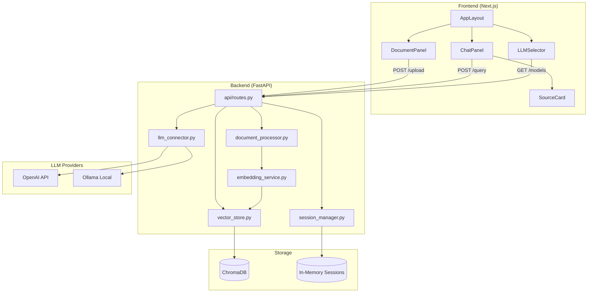

# Архитектурный дизайн: RAG Веб-приложение

## Обзор

RAG-приложение реализует паттерн Retrieval-Augmented Generation: пользователь загружает документы, система создаёт векторные эмбеддинги и сохраняет их в ChromaDB, при запросе извлекает топ-5 релевантных чанков и передаёт их как контекст в выбранную LLM (OpenAI или Ollama).

Ключевые ограничения:
- Документы: PDF/DOCX/TXT/MD, ≤50 МБ, ≤10 на сессию
- Чанки: 512 токенов, перекрытие 50 токенов
- Ответ LLM: ≤30 секунд
- Изоляция данных по сессиям

---

## Архитектура

### Диаграмма компонентов



### Поток данных: загрузка документа

```
Client → POST /upload → session_manager (validate session)
       → document_processor (parse + chunk)
       → embedding_service (encode chunks)
       → vector_store (upsert to ChromaDB with session_id namespace)
       → Response: {doc_id, chunk_count, status}
```

### Поток данных: RAG-запрос

```
Client → POST /query → session_manager (validate session)
       → embedding_service (encode query)
       → vector_store (similarity search, top-5, filtered by session_id)
       → llm_connector (build prompt with context + history)
       → LLM Provider → Response: {answer, sources}
```

---

## Компоненты и интерфейсы

### Backend компоненты

#### document_processor.py

```python
class DocumentProcessor:
    def parse(self, file_bytes: bytes, filename: str) -> ParsedDocument:
        """Парсит файл, возвращает текст с метаданными страниц."""

    def chunk(self, doc: ParsedDocument, chunk_size: int = 512, overlap: int = 50) -> list[Chunk]:
        """Разбивает документ на чанки с перекрытием."""
```

#### embedding_service.py

```python
class EmbeddingService:
    def encode(self, texts: list[str]) -> list[list[float]]:
        """Создаёт эмбеддинги через sentence-transformers."""
```

#### vector_store.py

```python
class VectorStore:
    def upsert(self, session_id: str, chunks: list[Chunk], embeddings: list[list[float]]) -> None: ...
    def search(self, session_id: str, query_embedding: list[float], top_k: int = 5) -> list[ChunkResult]: ...
    def delete_document(self, session_id: str, doc_id: str) -> None: ...
    def delete_session(self, session_id: str) -> None: ...
```

#### llm_connector.py

```python
class LLMConnector:
    def get_available_models(self) -> list[ModelInfo]: ...
    def generate(self, prompt: str, context: list[Chunk], history: list[Message], model: str, api_key: str | None) -> str: ...
```

#### session_manager.py

```python
class SessionManager:
    def create_session(self) -> Session: ...
    def get_session(self, session_id: str) -> Session: ...
    def terminate_session(self, session_id: str) -> None: ...
```

### Frontend компоненты

| Компонент | Ответственность |
|-----------|----------------|
| `AppLayout` | Двухпанельный layout (DocumentPanel + ChatPanel), responsive breakpoints |
| `DocumentPanel` | Drag-and-drop загрузка, список документов, выбор активных, удаление |
| `ChatPanel` | История сообщений, поле ввода, индикатор загрузки, SourceCard-и |
| `LLMSelector` | Dropdown выбора модели, поле API-ключа |
| `SourceCard` | Отображение источника: имя файла, номер страницы, релевантный фрагмент |

---

## Модели данных

### Session

```python
@dataclass
class Session:
    session_id: str          # UUID
    created_at: datetime
    selected_model: str
    api_key: str | None      # только в памяти, не персистируется
    documents: list[str]     # doc_id list, max 10
    messages: list[Message]
```

### Document

```python
@dataclass
class Document:
    doc_id: str              # UUID
    session_id: str
    filename: str
    file_format: Literal["pdf", "docx", "txt", "md"]
    uploaded_at: datetime
    page_count: int
    chunk_count: int
    status: Literal["processing", "ready", "error"]
```

### Chunk

```python
@dataclass
class Chunk:
    chunk_id: str            # UUID
    doc_id: str
    session_id: str
    text: str
    token_count: int         # ≤ 512
    page_number: int
    chunk_index: int         # порядковый номер в документе
    embedding: list[float] | None
```

### Message

```python
@dataclass
class Message:
    message_id: str
    session_id: str
    role: Literal["user", "assistant"]
    content: str
    created_at: datetime
    sources: list[SourceRef] | None  # только для role="assistant"

@dataclass
class SourceRef:
    doc_id: str
    filename: str
    page_number: int
    chunk_id: str
```

### ModelInfo

```python
@dataclass
class ModelInfo:
    model_id: str
    provider: Literal["openai", "ollama"]
    display_name: str
    available: bool
```

---

## API Design

### Endpoints

| Method | Path | Описание |
|--------|------|----------|
| `POST` | `/api/sessions` | Создать новую сессию |
| `DELETE` | `/api/sessions/{session_id}` | Завершить сессию, очистить данные |
| `POST` | `/api/sessions/{session_id}/documents` | Загрузить документ (multipart/form-data) |
| `GET` | `/api/sessions/{session_id}/documents` | Список документов сессии |
| `DELETE` | `/api/sessions/{session_id}/documents/{doc_id}` | Удалить документ |
| `POST` | `/api/sessions/{session_id}/query` | RAG-запрос |
| `GET` | `/api/sessions/{session_id}/messages` | История диалога |
| `GET` | `/api/models` | Список доступных LLM |
| `PUT` | `/api/sessions/{session_id}/model` | Выбрать модель для сессии |

### Схемы запросов/ответов

```python
# POST /api/sessions/{session_id}/query
class QueryRequest(BaseModel):
    question: str
    active_doc_ids: list[str] | None = None  # None = все документы сессии

class QueryResponse(BaseModel):
    answer: str
    sources: list[SourceRef]
    model_used: str
    elapsed_ms: int

# POST /api/sessions/{session_id}/documents → ответ
class UploadResponse(BaseModel):
    doc_id: str
    filename: str
    chunk_count: int
    status: Literal["ready", "error"]
    error_message: str | None
```

---

## Обработка ошибок

| Сценарий | HTTP код | Поведение |
|----------|----------|-----------|
| Файл > 50 МБ | 413 | `{"error": "FILE_TOO_LARGE", "max_bytes": 52428800}` |
| Неподдерживаемый формат | 415 | `{"error": "UNSUPPORTED_FORMAT", "allowed": ["pdf","docx","txt","md"]}` |
| Повреждённый файл | 422 | `{"error": "PARSE_ERROR", "detail": "<описание>"}` |
| Лимит документов (>10) | 409 | `{"error": "DOCUMENT_LIMIT_EXCEEDED", "limit": 10}` |
| LLM недоступна | 503 | `{"error": "LLM_UNAVAILABLE", "alternatives": [...]}` |
| Тайм-аут LLM (>30с) | 504 | `{"error": "LLM_TIMEOUT"}` |
| Сессия не найдена | 404 | `{"error": "SESSION_NOT_FOUND"}` |
| Нет документов для поиска | 400 | `{"error": "NO_DOCUMENTS", "message": "Загрузите документ"}` |

Все ошибки логируются на сервере. API-ключи никогда не попадают в логи.

---

## Стратегия тестирования

### Подход

Используется двойная стратегия: unit-тесты для конкретных примеров и граничных случаев + property-based тесты для универсальных свойств.

**Property-based testing библиотека:** `hypothesis` (Python)

Каждый property-тест запускается минимум 100 итераций (`@settings(max_examples=100)`).

Тег формата: `# Feature: rag-web-app, Property N: <текст свойства>`

### Unit-тесты

- Парсинг каждого формата (PDF/DOCX/TXT/MD) с валидными файлами
- Граничные случаи: пустой файл, файл с одной страницей, файл ровно 50 МБ
- Ошибки: повреждённый PDF, неверный DOCX, неподдерживаемый формат
- API endpoints: все коды ошибок из таблицы выше
- Изоляция сессий: данные сессии A не видны из сессии B

### Property-тесты

Каждое корректностное свойство реализуется одним property-тестом с `@given` из `hypothesis`.

```python
# Пример структуры
from hypothesis import given, settings
from hypothesis import strategies as st

# Feature: rag-web-app, Property 1: chunk size invariant
@given(text=st.text(min_size=1, max_size=10000))
@settings(max_examples=100)
def test_chunk_size_invariant(text):
    chunks = processor.chunk(ParsedDocument(text=text, pages=[]))
    assert all(c.token_count <= 512 for c in chunks)
```


---

## Correctness Properties

*A property is a characteristic or behavior that should hold true across all valid executions of a system — essentially, a formal statement about what the system should do. Properties serve as the bridge between human-readable specifications and machine-verifiable correctness guarantees.*

### Property 1: Инвариант размера чанка

*For any* текстового документа любого поддерживаемого формата, все чанки, созданные `Document_Processor`, должны иметь количество токенов ≤ 512.

**Validates: Requirements 1.2**

---

### Property 2: Валидация файлов отклоняет недопустимые входные данные

*For any* файла с неподдерживаемым форматом или размером > 50 МБ, `File_Uploader` должен вернуть ошибку и не создавать документ в сессии.

**Validates: Requirements 1.4, 1.5**

---

### Property 3: Полнота метаданных документа

*For any* успешно загруженного документа, объект `Document` должен содержать все обязательные поля: `filename`, `uploaded_at`, `page_count`, `chunk_count`, `status = "ready"`.

**Validates: Requirements 1.7**

---

### Property 4: Round-trip хранения чанков

*For any* документа, загруженного в сессию, каждый чанк после сохранения в `Vector_Store` должен быть доступен при поиске по его собственному эмбеддингу (similarity search возвращает этот чанк в топ-результатах).

**Validates: Requirements 1.3**

---

### Property 5: Round-trip парсинга документа

*For any* валидного документа формата PDF/DOCX/TXT/MD, результат `parse(format(parse(doc)))` должен быть эквивалентен `parse(doc)` — текст и структура страниц сохраняются.

**Validates: Requirements 5.5**

---

### Property 6: Инвариант количества результатов поиска

*For any* запроса к `Vector_Store` с параметром `top_k=5`, количество возвращённых чанков должно быть ≤ 5 (и > 0, если в хранилище есть документы).

**Validates: Requirements 3.1**

---

### Property 7: Источники содержат обязательные поля

*For any* ответа LLM, каждый объект `SourceRef` в списке `sources` должен содержать непустые `filename` и валидный `page_number` ≥ 1.

**Validates: Requirements 3.4**

---

### Property 8: Сохранение истории диалога

*For any* последовательности сообщений, отправленных в сессию, история диалога должна содержать все сообщения в том же порядке после каждого добавления.

**Validates: Requirements 3.5**

---

### Property 9: Удаление документа очищает чанки

*For any* документа, загруженного в сессию, после его удаления поиск в `Vector_Store` по чанкам этого документа не должен возвращать результатов.

**Validates: Requirements 4.2**

---

### Property 10: Лимит документов в сессии

*For any* сессии, количество документов со статусом `"ready"` или `"processing"` никогда не должно превышать 10. Попытка загрузить 11-й документ должна возвращать ошибку `DOCUMENT_LIMIT_EXCEEDED`.

**Validates: Requirements 4.5**

---

### Property 11: Изоляция данных между сессиями

*For any* двух различных сессий A и B, поиск в `Vector_Store` с `session_id=A` не должен возвращать чанки, принадлежащие сессии B, и наоборот.

**Validates: Requirements 7.1**

---

### Property 12: Очистка данных при завершении сессии

*For any* сессии с загруженными документами и историей диалога, после вызова `terminate_session` поиск по `session_id` в `Vector_Store` должен возвращать пустой результат, а объект сессии — быть недоступен.

**Validates: Requirements 7.2**

---

### Property 13: Выбор модели сохраняется в сессии

*For any* модели из списка доступных, после вызова `PUT /api/sessions/{id}/model` объект сессии должен содержать именно эту модель в поле `selected_model`.

**Validates: Requirements 2.2**

