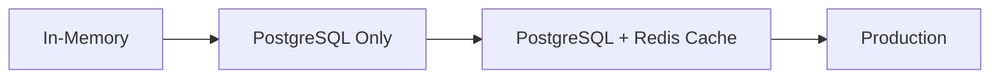

# ADR-002: Session Management Strategy

## Status

Accepted

## Date

2024-01-15

## Context

The RAG Chat Application needs to manage user sessions for:

- Storing chat history
- Tracking uploaded documents per user
- Managing LLM configuration per session
- Supporting multiple concurrent users

Current implementation uses in-memory storage, but this has significant limitations for production use.

## Decision

We will implement a **hybrid session management strategy**:

### Development Phase (Current)

**In-Memory Storage** using Python dictionaries:

```python
# In-memory session store
sessions: Dict[str, Session] = {}

class Session:
    id: str
    created_at: datetime
    llm_config: LLMConfig
    documents: List[Document]
    chat_history: List[ChatMessage]
```

**Pros:**
- Simple to implement
- Fast access (no network latency)
- No additional infrastructure needed
- Perfect for development and testing

**Cons:**
- Sessions lost on server restart
- No horizontal scaling (sessions not shared across instances)
- Memory constraints limit number of concurrent users
- No persistence

### Production Phase (Planned)

**PostgreSQL + Redis Hybrid Approach:**

```python
# PostgreSQL for persistent data
class SessionModel(BaseModel):
    id = Column(UUID, primary_key=True)
    created_at = Column(DateTime)
    llm_config = Column(JSONB)
    documents = Column(JSONB)  # Document metadata

# Redis for active session cache
session_cache: Redis = Redis()

async def get_session(session_id: str) -> Session:
    # Try cache first
    cached = await session_cache.get(f"session:{session_id}")
    if cached:
        return Session.parse_raw(cached)
    
    # Fallback to database
    db_session = await db.query(SessionModel).filter_by(id=session_id).first()
    if db_session:
        session = Session.from_db(db_session)
        await session_cache.setex(f"session:{session_id}", 3600, session.json())
        return session
    
    raise SessionNotFoundError
```

**PostgreSQL Role:**
- Persistent storage of session data
- Chat history (with pagination)
- Document metadata
- User data (when authentication is added)

**Redis Role:**
- Fast caching of active sessions
- Session expiration (TTL-based)
- Rate limiting
- Real-time features (WebSocket connections)

## Alternatives Considered

### 1. Pure In-Memory (Current)

**Pros:**
- Simplest implementation
- No additional dependencies

**Cons:**
- Not suitable for production
- No horizontal scaling
- Data loss on restart

**Status:** Used for development, needs replacement for production.

### 2. Pure PostgreSQL

**Description:** Store all session data in PostgreSQL.

**Pros:**
- Full persistence
- ACID transactions
- Easy backup/restore
- No additional infrastructure

**Cons:**
- Slower than Redis for frequent reads/writes
- More database load
- Connection pooling needed
- Complex queries for chat history

**Rejected:** PostgreSQL is great for persistence, but Redis provides better performance for frequently-accessed session data.

### 3. Pure Redis

**Description:** Store all session data in Redis.

**Pros:**
- Extremely fast
- Built-in expiration (TTL)
- Simple data models
- Good for session management

**Cons:**
- Data loss on restart (unless using persistence)
- Less structured than SQL
- No complex queries
- Memory constraints

**Rejected:** Redis persistence is not as reliable as PostgreSQL for critical data like chat history.

### 4. MongoDB

**Description:** Use MongoDB for session storage.

**Pros:**
- Flexible schema
- Good for document storage
- Built-in TTL support
- No schema migrations needed

**Cons:**
- Less mature than PostgreSQL
- Complex aggregation for chat history
- Larger memory footprint
- Team may have less MongoDB experience

**Rejected:** PostgreSQL is more mature and our team has more experience with it.

### 5. Firebase Realtime Database

**Description:** Use Firebase for real-time session synchronization.

**Pros:**
- Real-time updates
- Easy offline support
- Built-in authentication
- No server management

**Cons:**
- Vendor lock-in
- Cost at scale
- Limited querying capabilities
- Not suitable for complex data models

**Rejected:** We want to avoid vendor lock-in and have full control over infrastructure.

## Consequences

### Positive

1. **Development Speed:** In-memory storage allows rapid development
2. **Production Readiness:** PostgreSQL + Redis provides scalability
3. **Performance:** Redis caching ensures fast session access
4. **Reliability:** PostgreSQL ensures data persistence
5. **Flexibility:** Can swap components as needs evolve

### Negative

1. **Complexity:** Two storage systems to manage
2. **Consistency:** Need to handle cache invalidation
3. **Infrastructure:** More components to deploy and monitor
4. **Learning Curve:** Team needs to learn both PostgreSQL and Redis

### Migration Path



**Phase 1:** Add PostgreSQL for persistence (no Redis yet)
**Phase 2:** Add Redis for caching active sessions
**Phase 3:** Optimize and monitor performance

## References

- [Session Management in FastAPI](https://fastapi.tiangolo.com/tutorial/cookies/)
- [Redis for Session Management](https://redis.io/topics/sessions)
- [PostgreSQL JSONB for Flexible Schema](https://www.postgresql.org/docs/current/datatype-json.html)
